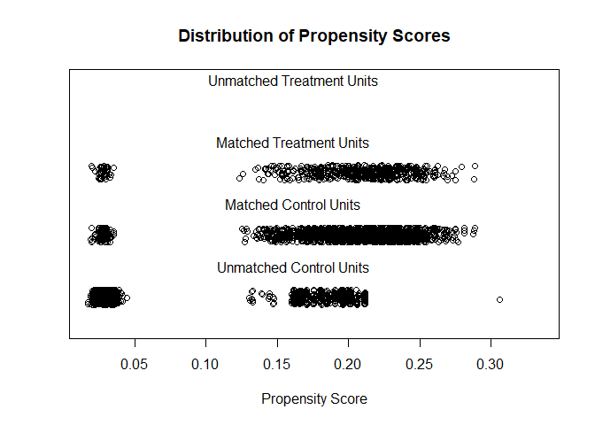
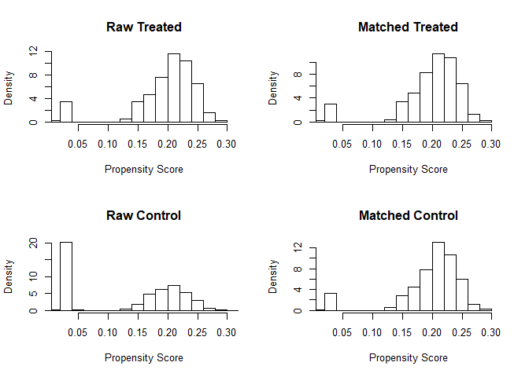
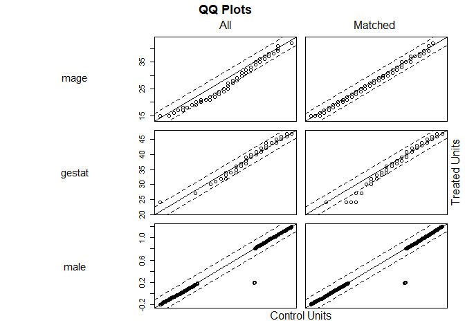
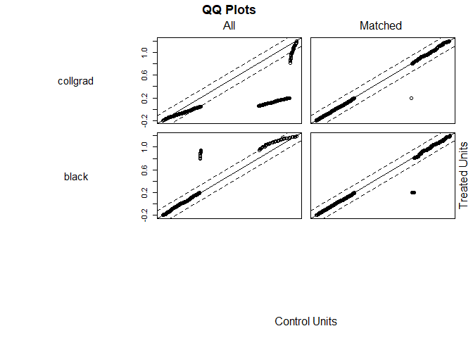
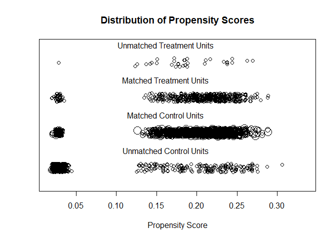
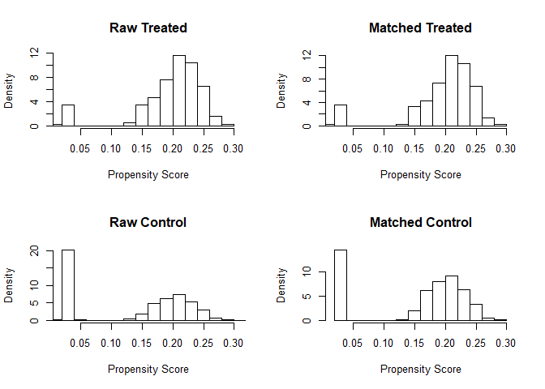
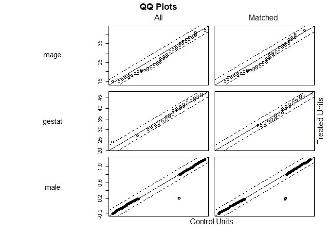
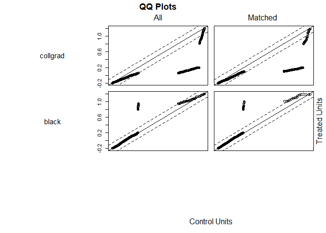

HDAT9700: Assessment 1A - Chapters 1 & 2
================

### Submission instructions

This is an R Markdown document---an example of *literate programming*, an approach which allows users to interweave text, statistical output and the code that produces that output.

To complete your assignment:

-   Edit this file directly, interweaving text and R code as appropriate to answer the questions below. Remember to `Knit` the file to make sure everything is running smoothly. Detailed information on R Markdown is available [here](https://rmarkdown.rstudio.com/lesson-1.html), and there is a useful cheatsheet [here](https://www.rstudio.com/wp-content/uploads/2015/02/rmarkdown-cheatsheet.pdf).

-   Use git to `commit` changes you make in this repo locally.

-   `Push` the repo, together with this edited file and the corresponding `.md` file to GitHub Classroom.

You can `commit` and `push` as often as neccessary---your assessment will be graded on the most recent version of your repo at the assessment due date.

Good luck!

------------------------------------------------------------------------

### Overview

In this assignment you are provided with data on maternal characteristics and birth outcomes. Your aim is to assess the causal effect of maternal smoking during pregnancy on child's birthweight.

The data come from [Abrevaya (2006)](https://onlinelibrary.wiley.com/doi/abs/10.1002/jae.851) *Estimating the effect of smoking on birth outcomes using a matched panel data approach*. For the purposes of this assignment, the dataset has been restricted to mother's first birth. More details can be found [here](http://qed.econ.queensu.ca/jae/2006-v21.4/abrevaya/readme.ja.txt).

#### Here is a brief description of the available variables:

-   **momid** identification number of the mother
-   **idx** index number of a mother's birth
-   **mage** age of mother (in years)
-   **gestat** length of gestation (in weeks)
-   **birwt** birthweight (in grams)
-   **smoke** indicator variable for smoking status (1=smoker, 0=nonsmoker)
-   **male** sex of the baby (1=male, 0=female)
-   **collgrad** college-graduate indicator (1=graduate, 0=non-graduate)
-   **black** indicator variable for black race (1=black, 0=white)

These data are contained in your assignment repo and can be read as follows:

``` r
dat <- read.csv("smoking_data_first_born.csv", header=TRUE)
head(dat)
```

    ##   momid idx mage gestat birwt smoke male collgrad black
    ## 1    14   1   16     24  2790     0    0        0     1
    ## 2    25   1   23     41  2778     0    1        0     1
    ## 3    39   1   36     41  2948     0    1        0     0
    ## 4    48   1   30     39  2880     1    1        0     0
    ## 5    60   1   23     43  3714     0    0        0     1
    ## 6    71   1   20     40  3203     1    1        0     0

------------------------------------------------------------------------

### Assessment questions

##### (1) There are nine variables in the dataset. Select which variables you will consider for matching and justify your decision (10%)

We would use mage (mother's age), gestat (length of gestation), male (baby's sex), collgrad (weather the mother is college educated), and black (whether the baby is black or not) to match because any of thouse factors could be confounders. Most obviously, length of gestation has an impact on bithweight and should be matched between smokers and non-smokers.

We don't use momid (mom id) and idx(index number of birth) to match because they are just random values assigned. They have no significance and each one is unique. Birthweight (birwt) is the outcome variable, so we do not want to match based on that; we want to see the difference in birthweight because of smoking. Smoke is the variable we want to compare, so we are matching to balance out possible confounders between smokers and non-smokers and is therefore the variable we are using the other above variables to match between.

##### (2) Using your chosen variables, match smokers to non-smokers using the matching specifications in (2a) and (2b). Briefly summarise the balance in both cases, drawing on appropriate numerical and graphical summaries.

##### (2a) 3:1 nearest-neighbour matching using the propensity score distance metric (20%)

``` r
library(MatchIt)
match_propensity <- matchit(smoke ~ mage + gestat + male + collgrad + black, data=dat, method = "nearest", distance = "logit", ratio = 3)
summary(match_propensity)
```

    ## 
    ## Call:
    ## matchit(formula = smoke ~ mage + gestat + male + collgrad + black, 
    ##     data = dat, method = "nearest", distance = "logit", ratio = 3)
    ## 
    ## Summary of balance for all data:
    ##          Means Treated Means Control SD Control Mean Diff eQQ Med eQQ Mean
    ## distance        0.1962        0.1320     0.0886    0.0642  0.0322   0.0642
    ## mage           25.3119       27.7012     5.1883   -2.3893  2.0000   2.3957
    ## gestat         39.5419       39.3980     1.9974    0.1439  0.0000   0.3743
    ## male            0.4938        0.5057     0.5000   -0.0119  0.0000   0.0125
    ## collgrad        0.0731        0.4065     0.4913   -0.3334  0.0000   0.3333
    ## black           0.0980        0.0670     0.2501    0.0310  0.0000   0.0303
    ##          eQQ Max
    ## distance  0.1638
    ## mage      4.0000
    ## gestat    3.0000
    ## male      1.0000
    ## collgrad  1.0000
    ## black     1.0000
    ## 
    ## 
    ## Summary of balance for matched data:
    ##          Means Treated Means Control SD Control Mean Diff eQQ Med eQQ Mean
    ## distance        0.1962        0.1954     0.0555    0.0008   5e-04   0.0009
    ## mage           25.3119       25.4266     5.4288   -0.1147   0e+00   0.2121
    ## gestat         39.5419       39.5348     2.1522    0.0071   0e+00   0.2282
    ## male            0.4938        0.5128     0.5000   -0.0190   0e+00   0.0178
    ## collgrad        0.0731        0.0731     0.2604    0.0000   0e+00   0.0000
    ## black           0.0980        0.1111     0.3144   -0.0131   0e+00   0.0125
    ##          eQQ Max
    ## distance  0.0067
    ## mage      1.0000
    ## gestat    3.0000
    ## male      1.0000
    ## collgrad  0.0000
    ## black     1.0000
    ## 
    ## Percent Balance Improvement:
    ##          Mean Diff.  eQQ Med eQQ Mean  eQQ Max
    ## distance    98.7413  98.5274  98.6178  95.9387
    ## mage        95.2003 100.0000  91.1458  75.0000
    ## gestat      95.0444   0.0000  39.0476   0.0000
    ## male       -59.1685   0.0000 -42.8571   0.0000
    ## collgrad   100.0000   0.0000 100.0000 100.0000
    ## black       57.8616   0.0000  58.8235   0.0000
    ## 
    ## Sample sizes:
    ##           Control Treated
    ## All          3417     561
    ## Matched      1683     561
    ## Unmatched    1734       0
    ## Discarded       0       0

``` r
plot(match_propensity, type="jitter")
```



    ## [1] "To identify the units, use first mouse button; to stop, use second."

    ## integer(0)

``` r
plot(match_propensity, type="hist")
```



``` r
plot(match_propensity, type="QQ")
```



##### (2b) Coarsened Exact Matching (20%)

``` r
match_cem <- matchit(smoke ~ mage + gestat + male + collgrad + black, data=dat, method = "cem")
```

    ## 
    ## Using 'treat'='1' as baseline group

``` r
summary(match_cem)
```

    ## 
    ## Call:
    ## matchit(formula = smoke ~ mage + gestat + male + collgrad + black, 
    ##     data = dat, method = "cem")
    ## 
    ## Summary of balance for all data:
    ##          Means Treated Means Control SD Control Mean Diff eQQ Med eQQ Mean
    ## distance        0.1962        0.1320     0.0886    0.0642  0.0322   0.0642
    ## mage           25.3119       27.7012     5.1883   -2.3893  2.0000   2.3957
    ## gestat         39.5419       39.3980     1.9974    0.1439  0.0000   0.3743
    ## male            0.4938        0.5057     0.5000   -0.0119  0.0000   0.0125
    ## collgrad        0.0731        0.4065     0.4913   -0.3334  0.0000   0.3333
    ## black           0.0980        0.0670     0.2501    0.0310  0.0000   0.0303
    ##          eQQ Max
    ## distance  0.1638
    ## mage      4.0000
    ## gestat    3.0000
    ## male      1.0000
    ## collgrad  1.0000
    ## black     1.0000
    ## 
    ## 
    ## Summary of balance for matched data:
    ##          Means Treated Means Control SD Control Mean Diff eQQ Med eQQ Mean
    ## distance        0.1968        0.1967     0.0566    0.0001  0.0216   0.0446
    ## mage           25.1705       25.1966     5.4176   -0.0261  2.0000   2.1875
    ## gestat         39.6231       39.6331     2.0676   -0.0100  0.0000   0.3845
    ## male            0.5019        0.5019     0.5001    0.0000  0.0000   0.0341
    ## collgrad        0.0758        0.0758     0.2647    0.0000  0.0000   0.2121
    ## black           0.0720        0.0720     0.2585    0.0000  0.0000   0.0360
    ##          eQQ Max
    ## distance  0.1533
    ## mage      4.0000
    ## gestat    2.0000
    ## male      1.0000
    ## collgrad  1.0000
    ## black     1.0000
    ## 
    ## Percent Balance Improvement:
    ##          Mean Diff. eQQ Med  eQQ Mean eQQ Max
    ## distance    99.7865 32.8776   30.5771  6.4118
    ## mage        98.9077  0.0000    8.6914  0.0000
    ## gestat      93.0547  0.0000   -2.7083 33.3333
    ## male       100.0000  0.0000 -173.2143  0.0000
    ## collgrad   100.0000  0.0000   36.3636  0.0000
    ## black      100.0000  0.0000  -18.7500  0.0000
    ## 
    ## Sample sizes:
    ##           Control Treated
    ## All          3417     561
    ## Matched      2591     528
    ## Unmatched     826      33
    ## Discarded       0       0

``` r
plot(match_cem, type="jitter")
```



    ## [1] "To identify the units, use first mouse button; to stop, use second."

    ## integer(0)

``` r
plot(match_cem, type="hist")
```



``` r
plot(match_cem, type="QQ")
```



\*\*\*\*\*\*\*\*\*\*\*
======================

Summary of the balanced data shows similar averages for propensity score matching catagories.

mage: smoke:25,3, non:25.4
gestat: 39.5, 39.5
male: .5,.5
collgrad: .07,.07
black:.09,.11

Summary of the balanced data shows similar averages for coarse exact matching catagories.

mage: smoke:25,2, non:25.2
gestat: 39.6, 39.6
male: .5,.5 collgrad: .08,.08
black:.07,.07

While averages match almost exactly between groups for the "CEM" matching, there are two things that make me think "propensity score"" matching is better to use.

1.  When looking at the QQ plots, the proprietary score matching has better eveness - the plots stay along the 45 degree angle better

2.  All of the smokers are matched, where "cem" removed 33 from the smoking data set. Because there are only 561 smokers, loosing 33 records could reflect a bias and does not seem to be neccesary in this case.

##### (3) Fit the model birwt ~ smoke in

##### (3a) The raw data (5%)

``` r
mod_raw <- lm(birwt ~ smoke, data=dat)
summary(mod_raw)
```

    ## 
    ## Call:
    ## lm(formula = birwt ~ smoke, data = dat)
    ## 
    ## Residuals:
    ##     Min      1Q  Median      3Q     Max 
    ## -2527.9  -302.9     9.1   321.1  1801.9 
    ## 
    ## Coefficients:
    ##             Estimate Std. Error t value Pr(>|t|)    
    ## (Intercept) 3477.902      8.495  409.42   <2e-16 ***
    ## smoke       -289.763     22.620  -12.81   <2e-16 ***
    ## ---
    ## Signif. codes:  0 '***' 0.001 '**' 0.01 '*' 0.05 '.' 0.1 ' ' 1
    ## 
    ## Residual standard error: 496.6 on 3976 degrees of freedom
    ## Multiple R-squared:  0.03963,    Adjusted R-squared:  0.03939 
    ## F-statistic: 164.1 on 1 and 3976 DF,  p-value: < 2.2e-16

##### (3b) the matched data, using your preferred match from 2a/2b (5%)

``` r
#turn match propensity into data
match_prop.data <- match.data(match_propensity)

mod_prop <- lm(birwt ~ smoke, data=match_prop.data, weight=weights)
summary(mod_prop)
```

    ## 
    ## Call:
    ## lm(formula = birwt ~ smoke, data = match_prop.data, weights = weights)
    ## 
    ## Residuals:
    ##      Min       1Q   Median       3Q      Max 
    ## -2509.98  -312.98    15.86   311.02  1801.86 
    ## 
    ## Coefficients:
    ##             Estimate Std. Error t value Pr(>|t|)    
    ## (Intercept)  3459.98      12.19  283.87   <2e-16 ***
    ## smoke        -271.84      24.38  -11.15   <2e-16 ***
    ## ---
    ## Signif. codes:  0 '***' 0.001 '**' 0.01 '*' 0.05 '.' 0.1 ' ' 1
    ## 
    ## Residual standard error: 500 on 2242 degrees of freedom
    ## Multiple R-squared:  0.05255,    Adjusted R-squared:  0.05213 
    ## F-statistic: 124.3 on 1 and 2242 DF,  p-value: < 2.2e-16

##### (4) Briefly describe the model results. How does the estimated effect for smoking change and why? (10%)

The coefficient of smoking for the raw data is -289.76 and a p value very close to 0.
The coefficient of smoking for the matched data is -279.79 and also a p-value very close to 0.
This means that the matched data shows smoking has less of an effect than the raw data. This makes sense because we expect non-smokers to get further in gestation, as well as there being other confounders such as education which may correlate to nutrition and other unseen factors.

Because some of these confounders correlate, if we wanted to see birthweight factoring that smoking leads to early gestation, we could try to match adjusting for the average difference in gestation period for smokers and non-smokers.

##### (5) Briefly argue whether or not the assumption of exchangeability is likely to hold in the implicit causal model underpinning 3b. (10%)

##### (6) These data come from an observational study. Imagine the **exact same data** arose from a Randomised Control Trial where mothers were randomised to smoke or not smoke during pregnancy (ignore the obvious ethical issues of such a trial for the sake of this question).

##### (6a) What can you observe about the randomisation process? (5%)

##### (6b) How would the roll of background variables like mother's race and education change in the analysis, given that the data came from an RCT? (15%)

------------------------------------------------------------------------

### Student declaration

***Instructions: Indicate that you understand and agree with the following three statements by typing an x in the square brackets below, e.g. \[x\].***

I declare that this assessment item is my own work, except where acknowledged, and has not been submitted for academic credit elsewhere or previously, or produced independently of this course (e.g. for a third party such as your place of employment) and acknowledge that the assessor of this item may, for the purpose of assessing this item: (i) Reproduce this assessment item and provide a copy to another member of the University; and/or (ii) Communicate a copy of this assessment item to a plagiarism checking service (which may then retain a copy of the assessment item on its database for the purpose of future plagiarism checking).

-   \[x\] I understand and agree

I certify that I have read and understood the University Rules in respect of Student Academic Misconduct.

-   \[x\] I understand and agree

I have a backup copy of the assessment.

-   \[x\] I understand and agree
